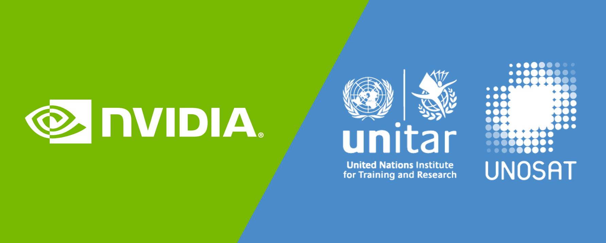

***The course material is the property of NVIDIA Corporation and is protected under copyright law. Unauthorized reproduction, distribution, or use of the material without NVIDIA Corporation's explicit permission is strictly prohibited. For inquiries regarding licensing or usage permissions, please contact NVIDIA Corporation directly through their official channels.***

# Disaster Risk Monitoring Using Satellite Imagery
I have learned how to build and deploy a flood detection segmentation model using data collected from Sentinel-1 satellites. In order to achieve this, I have used NVIDIA's DALI, TAO Toolkit, TensorRT, and Triton Inference Server.

- The Application of Computer Vision for Disaster Risk Monitoring
- Manipulation of Data Collected by Earth Observation Satellites
- Ways to Efficiently Process Large Imagery Data
- Deep Learning Model Development Challenges
- End-to-End Machine Learning Workflow

## Content

- [Introduction](#introduction)
- [Disaster Risk Monitoring Systems and Data Pre-Processing](#disaster-risk-monitoring-systems-and-data-pre-processing)
- [Efficient Model Training](#efficient-model-training)
- [Deploying a Model for Inference](#deploying-a-model-for-inference)

## Introduction


file: [00_introduction.ipynb](https://github.com/TahaMahmood24/Disaster-Risk-Monitoring-Using-Satellite-Imagery/blob/main/00_introduction.ipynb)

> Natural disasters such as flood, wildfire, drought, and severe storms wreak havoc throughout the world, causing billions of dollars in damages, and uprooting communities, ecosystems, and economies. The ability to detect, quantify, and potentially forecast natural disasters can help us minimize their adverse impacts on the economy and human lives. While this lab focuses primarily on detecting flood events, it should be noted that similar applications can be created for other natural disasters. 

## Disaster Risk Monitoring Systems and Data Pre-Processing

### Introduction to Floods 

A [Flood](https://en.wikipedia.org/wiki/Flood) is an overflow of water that submerges land that is usually dry. They can occur under several conditions:
- Overflow of water from water bodies, in which the water overtops or breaks levees (natural or man-made), resulting in some of that water escaping its usual boundaries.
- Accumulation of rainwater on saturated ground in an areal flood.
- When flow rate exceeds the capacity of the river channel.

Unfortunately, flooding events are on the rise due to climate change and sea level rise. Due to the increase in frequency and intensity, the topic of flood has garnered international attention in the past few years. In fact, organizations such as the United Nations have maintained effective response and proactive risk assessment for floods in their [Sustainable Development Goals](https://en.wikipedia.org/wiki/Sustainable_Development_Goals).

### Sentinel-1 Mission and Flood Monitoring 

Earth observation satellites like [Copernicus Sentinel-1](https://sentinel.esa.int/web/sentinel/missions/sentinel-1) provide essential data for flood monitoring. Sentinel-1 utilizes C-band [Synthetic Aperture Radar](https://en.wikipedia.org/wiki/Synthetic-aperture_radar) (SAR) data, which can operate day and night and penetrate through clouds, making it ideal for continuous monitoring. The Sentinel-1 mission's frequent revisit time and high-resolution imagery enable effective flood risk assessment over time.

### Deep Learning Model Training Workflow

Building a deep learning model involves several steps: collecting high-quality datasets, data preparation, model training, and optimization for deployment. Deep learning models, particularly those trained with supervised learning, excel in automatic feature extraction and association, enhancing their predictive capabilities.

### Challenges in Deep Learning

Developing deep learning solutions presents several challenges:
- Training accurate models demands substantial annotated data, which is costly and time-consuming to acquire.
- Familiarity with deep learning frameworks like [TensorFlow](https://www.tensorflow.org/), [PyTorch](https://pytorch.org/), or [Caffe](https://caffe.berkeleyvision.org/) is essential.
- Fine-tuning models for optimal performance and inference readiness requires significant effort.
- Real-time data processing is computationally intensive, necessitating robust software and hardware infrastructure.

### Sentinel-1 Data Public Access

Sentinel-1 SAR data is accessible via [ESA's Copernicus Open Access Hub](https://scihub.copernicus.eu/) and other platforms like [NASA's EARTHDATASEARCH](https://search.earthdata.nasa.gov/) and [Vertex](https://search.asf.alaska.edu/#/). These datasets, organized into tiles, facilitate efficient storage and retrieval of geographic imagery.

### Data Pre-processing With DALI

Deep learning models require extensive data preprocessing to ensure compatibility with neural networks. Traditionally handled by CPUs, preprocessing is increasingly transitioned to GPUs for enhanced throughput and performance. [NVIDIA's DALI](https://developer.nvidia.com/dali) addresses CPU bottlenecks by accelerating data loading and preprocessing tasks, supporting various image, video, and audio formats.


DALI offers:
- Optimized data processing primitives tailored for deep learning applications.
- A dedicated execution engine for maximizing input pipeline throughput.
- Seamless integration with major deep learning frameworks, enhancing portability and scalability.

### Data Augmentation

Data augmentation techniques, such as geometric transformations, color adjustments, and noise addition, expand training datasets and improve model robustness and accuracy. DALI integrates these augmentations seamlessly into training workflows, enhancing model performance and generalization.


## Efficient Model Training
file: [02_efficient_model_training.ipynb](https://github.com/TahaMahmood24/Disaster-Risk-Monitoring-Using-Satellite-Imagery/blob/main/02_efficient_model_training.ipynb)


### Introduction to Floods <a name="introduction-to-floods"></a>

In this notebook, I have learned how to train a segmentation model with the [TAO Toolkit](https://developer.nvidia.com/tao) using pre-trained ResNet-18 weights. Additionally, I have learned how to export the model for deployment.

It allows developers to fine-tune pretrained models with custom data efficiently, eliminating the need for extensive training and deep AI expertise. Moreover, it facilitates model optimization for inference performance.


In practice, starting a learning task on a network with randomly initialized weights can be inefficient due to factors such as data scarcity or prolonged training times. Transfer learning mitigates this by transferring learned features from one application to another, which works well because early layers in neural networks share similar functionalities across tasks.

For instance, early layers in a convolutional neural network primarily identify outlines and curves, making them suitable as feature extractors for related tasks in different domains. More information about transfer learning is available in this [Nvidia blogpost](https://blogs.nvidia.com/blog/2019/02/07/what-is-transfer-learning/).


### Vision AI Pre-trained Models Supported

The TAO Toolkit supports a variety of pre-trained models for image classification, object detection, and segmentation. These models enable developers to quickly train AI models with custom data, ranging from lightweight models for edge deployment to complex models for robust applications.

When using TAO, developers select a model architecture and a supported backbone, such as ResNet-18, to serve as a feature extractor.

| | **Image Classification** | **Object detection** - DetectNet_V2 | **Object detection** - FasterRCNN | **Object detection** - SSD | **Object detection** - YOLOV3 | **Object detection** - YOLOV4 | **Object detection** - RetinaNet | **Object detection** - DSSD | **Segmentation** - MaskRCCN | **Segmentation** - Unet |
|:------:|:-----:|:-----:|:-----:|:-----:|:----:|:-----:|:----:|:----:|:---:|:---:|
| **ResNet10/18/34/50/101** | OK | OK | OK | OK | OK | OK | OK | OK | OK | OK |
| **VGG16/19** | OK | OK | OK | OK | OK | OK | OK | OK |  | OK |
| **GoogLeNet** | OK | OK | OK | OK | OK | OK | OK | OK |  |  |
| **MobileNet** | V1/V2 | OK | OK | OK | OK | OK | OK | OK | OK |  |
| **SqueezeNet** | OK | OK |  | OK | OK | OK | OK | OK |  |  |
| **DarkNet19/53** | OK | OK | OK | OK | OK | OK | OK | OK |  |  |
| **CSPDarkNet19/53** | OK |  |  |  |  | OK |  |  |  |  |
| **EfficientnetB0** | OK |  | OK | OK |  |  | OK | OK |  |  |

Building disaster risk monitoring systems requires adapting components for deployment, often involving cycles of re-training and fine-tuning models until they meet deployment requirements.

### U-Net Semantic Segmentation Model

[U-Net](https://catalog.ngc.nvidia.com/orgs/nvidia/teams/tao/models/pretrained_semantic_segmentation) is a widely-used network architecture for image segmentation tasks. For disaster risk monitoring, we aim to label each pixel as either `flood` or `not flood`. With TAO, we can utilize ResNet-18 as the feature extractor for the `unet` task, which supports various subtasks like `train`, `evaluate`, `inference`, and `export`.


### TensorRT - Programmable Inference Accelerator

NVIDIA [TensorRT](https://developer.nvidia.com/tensorrt) optimizes deep learning inference with high performance and low latency. It supports model optimization and deployment across different hardware configurations, enhancing inference speed by up to 40x compared to CPU-only platforms.

For detailed resources on TensorRT:
- [Main Page](https://developer.nvidia.com/tensorrt)
- [Blogs](https://devblogs.nvidia.com/speed-up-inference-tensorrt/)
- [Download](https://developer.nvidia.com/nvidia-tensorrt-download)
- [Documentation](https://docs.nvidia.com/deeplearning/sdk/tensorrt-developer-guide/index.html)
- [Sample Code](https://docs.nvidia.com/deeplearning/sdk/tensorrt-sample-support-guide/index.html)
- [GitHub](https://github.com/NVIDIA/TensorRT)
- [NGC Container](https://ngc.nvidia.com/catalog/containers/nvidia:tensorrt)

---

By leveraging TAO Toolkit and TensorRT, developers can efficiently build and deploy robust disaster risk monitoring systems with state-of-the-art AI capabilities. This approach significantly accelerates development cycles and optimizes models for real-world deployment scenarios.

## Deploying a Model for Inference

file: [03_model_deployment_for_inference.ipynb](https://github.com/TahaMahmood24/Disaster-Risk-Monitoring-Using-Satellite-Imagery/blob/main/03_model_deployment_for_inference.ipynb)

### 1. Introduction to NVIDIA TAO Toolkit

In this notebook, I've learned how to train a segmentation model using the NVIDIA Transfer Learning Toolkit (TAO), specifically utilizing a U-Net architecture with a ResNet-18 backbone for semantic segmentation tasks. The TAO Toolkit streamlines the process of fine-tuning pre-trained models and exporting them for deployment, reducing the need for extensive data and training efforts.

### 2. U-Net Semantic Segmentation Model

#### Model Architecture and Training

The U-Net model architecture is designed for image segmentation tasks, such as identifying flooded areas. Using TAO, we trained this model with custom data following these steps:

- **Downloading Pre-trained Model**: We chose ResNet-18 as the feature extractor backbone.
- **Preparing Data Set**: Data was formatted as required by TAO for semantic segmentation tasks.
- **Model Training**: Utilized a training specification file to configure the training process.
- **Exporting Trained Model**: The trained model was exported for deployment.

#### Exporting Trained Model

The export process decouples the model from training and prepares it for deployment. The exported model can be used with TensorRT for optimized inference performance.

### 3. Deployment with Triton Inference Server

#### Triton Inference Server Overview

[NVIDIA Triton Inference Server](https://developer.nvidia.com/nvidia-triton-inference-server) simplifies AI model deployment at scale. It supports various frameworks and can run on any GPU or CPU-based infrastructure.

#### Setting Up Triton Server

- **Server Installation**: Triton Server was set up using a container from NVIDIA NGC.
- **Client Setup**: Installed Triton Inference Server Client libraries for communication.
  
#### Creating Model Repository

Models are organized in a model repository. Each model has its own directory structure with versions. For example:

```
/models
└── flood_segmentation_model
    └── 1
        ├── model.plan
        └── config.pbtxt
```

#### Model Configuration for Triton

Configuration files (`config.pbtxt`) specify model details like batch size, input/output tensors, and backend platform (TensorRT, PyTorch, etc.).

#### Running Inference on Triton

- Triton handles inference requests via HTTP/REST or gRPC.
- Models are loaded and managed dynamically, allowing updates without server restarts.

### 4. Pre-processing Inputs for Inference

Ensuring inputs are pre-processed identically to training is crucial for accurate inference. This involves normalization and mean subtraction, following configurations specified during model training.


## Conclusion 
Once deployed, the Triton Inference Server can be connected to front-end applications such as those that power https://www.balcony.io/, which provides an emergency management platform that has the ability to send messages to personal devices. In terms of making the model better, improving on metrics like Intersect-Over-Union (IoU) translates to accurate flood modeling, and coupled with a time-optimized solution aids in real-time disaster response and eventual climate action. 

------
